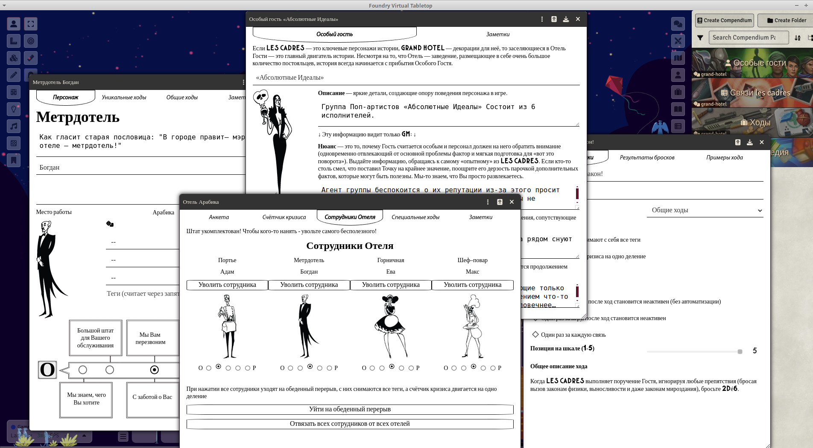
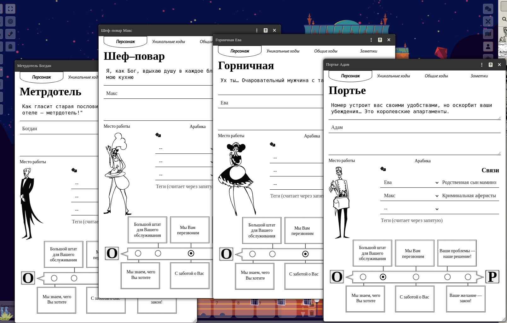

# Grand Hotel

Система для НРИ Grand Hotel на [Foundry VTT v13+](https://foundryvtt.com/ "Что ещё за фаундри такой?") на русском языке. 

Пакет разработан под руководством авторов игры [Geese and Dragons](https://t.me/GrandLaHotel)

Пакет в каталоге Foundry VTT: https://foundryvtt.com/packages/grand-hotel

Книга правил https://rpgbook.ru/GRAND_HOTEL

## Как часто вы задумываетесь о героях?

Не тех, что носят трико и не тех, что сражаются с мифическими гидрами.  О Героях! НАСТОЯЩИХ Героях наших дней! Обслуживающем персонале! "Ха-ха"- скажете вы. "Да чего здесь героического?" -  подумаете вы.  Готовы принять вызов? Попробовать примерить отглаженную униформу, написать на золочённом бейджике своё имя и продержаться всего ОДНУ смену за стойкой элитного заведения? Вы принимаете вызов? Чудесно! Двери GRAND HOTEL уже распахиваются перед вами! Легендарный Отель, существующий вне законов времени, физики и здравого смысла. Отель, на крыше которого может быть припаркована летающая тарелка, а в бассейнах обитать саламандры. Отель, где древний вампир может проиграть своё состояние агенту спецразведки в преферанс.  Отель,  где существует блуждающая комната и кричащая лестница.  Отель,  где с драконами сражаются за чаевые! Всего одна смена,  господа! Продержитесь сутки и не дайте стенам этого заведения рухнуть! Ах-да! Поищите в кустах название,  где-то рядом с роялем. Оно всегда отваливается. 

## Возможности

### Лист les cadres

Можно выбрать 4 роли из книги правил:

В листе каждой роли выводятся основные характеристики, цитата, картинка, связи, теги, ходы и заметки. 

Теги считает через запятую, например: 

При достижении ограничения тегов (настройка находится в Листе Отеля, и мастер может сам определить требуемое количество тегов), блокируется ход до ближайшего отдыха(если ход блокируется по другой причине, то надписи про теги не будет):

 

Уникальные ходы можно помечать как использовано путем включения и выключения хода через правый клик мыши на ходе. Для уникального хода **Один раз за каждую связь**, можно добавить или удалить тег коллеги путём правого клика именно на этом ходе. Чтобы список сформировался, в начале необходимо указать коллег в разделе **Связи**.

Броски возможны со вкладки **Основные ходы**, при правом клике на соответствующем ходу. Возможны как обычные броски, так и с преимуществом. Так же, если у хода есть примеры применения, то будет пункт **Примеры хода**. 

**Положительные и отрицательные бонусы к вашим броскам высчитывает исходя из положения Точки на шкале ОР**. При совершении броска, можете раскрыть в чате блок информации, в нём содержится информация: название хода, как что считалось (зеленые квадраты это учтенные кубы, когда куба три это бросок с преимуществом, и красный откидывает из подсчёта, показывает какой), а так же показывает текст варианта хода на конкретный результат: 

 

Вкладка с редактором заметок о персонаже видна всем, кто видит чарник. Туда можно вносить различную информацию по ходу игры. 

Поле **Место работы** заполняется автоматически, когда мастер нанимает сотрудника в Отель. 

Связи заполняются из доступных персонажей. Для этого они должны быть предварительно созданы: 

 

Так же можно нажать автогенерацию текста связей, тогда заполнит текстовые поля связей из таблички в корнике, но только для тех персонажей, что выбраны из выпадающих списков:

 

Если поле цитаты не заполнено, то автоматически подставит из буклета по корнику. 

При нажатие на изображение даст возможность выбрать свою аватарку. По умолчанию, подставляет аватарку из буклета. 

### Лист Отеля 
(сотрудников в Отель необходимо предварительно нанять)

### Лист Особого гостя

Компендум Особых гостей составлен на основе Книги правил и конкурсных работ в телегочате. 

 

Информацию в заметках видят все игроки, которым доступен чарник гостя к просмотру. Там может быть какая-то оперативная информация, которая копится в ходе игры. Что-то вроде Гость шел по лестнице и порвал пятую точку. 

На лицевой стороне чарника после надписи "Эту информацию видит только GM" все ниже следующие поля не доступны игрокам. Им доступно только Имя, Фото, Описание и Заметки в другой вкладке.

### Лист хода
Лист хода нужен только в случае, если вы захотите менять настройки текущих ходов, или добавлять свои ходы. Если натыкали и всё сломалось - вам проще пересоздать мир. Настройки интуитивно понятны что за что отвечает, если вы прочитали книгу правил. Если после книги понятнее не стало, то в чате игры было видео с объяснением как это работает. 

 

### Дополнительные возможности

Русскоязычные компендумы, памятки и локализация, а так же упоминания в чат при различных событиях, которые игра подсчитывает за вас:

 

### Манипуляции с колодой карт

 
